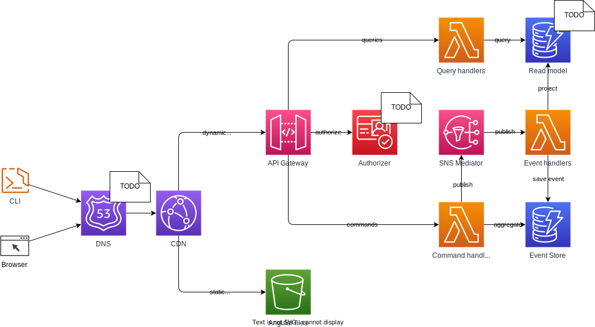

# `clean-arch-todos`

[](https://github.com/alexx666/clean-arch-todos/actions/workflows/tests.yml)
[](https://conventionalcommits.org)

Monorepo for practicing and studying software architecture and system design concepts:

- Domain Driven Design (DDD)
- Command and Query Responsibility Segregation (CQRS)
- Event Sourcing (ES)
- Clean Architecture

## Architecture

The project is a simple todo list app...for now! Glorified and overengineered for the purposes of learning. Its componed of the following parts:

### [Libraries](../libs/)

- [`@alexx666/todos`](../libs/todos/README.md) - provides core business logic usable in all of the `applications`

### [Applications](../apps/)

- [`@alexx666/todos-cli`](../apps/cli/README.md) - CLI tool for interracting with the API
- [`todos-api`](../apps/api/README.md) - REST API which provideds the core logic of the app
- [`web`](../apps//web/) - minimal [Angular](https://angular.io/) frontend managed with [NX](https://nx.dev/) and [NGRX](https://ngrx.io/)



## Pre-requisites:

- [`nodejs v16.x`](https://nodejs.org/es/download/)
- [`npm v8.x`](https://docs.npmjs.com/downloading-and-installing-node-js-and-npm)
- [`docker`](https://docs.docker.com/engine/install/)

> Note: These versions or above required since the project uses NPM `workspaces` and NodeJS `crypto` library

## Getting Started

The following instruction can get the system up an running on your system.

### Installing

```
npm ci
```

### Building

_Build Source_

```
npm run build
```

_Build API_

```
npm run registry
npm publish -w libs/
npm run build -w apps/api
```

_Build Docs_

```
npm run build:docs
```

### Running

_Run API_

```
npm start -w apps/api --silent -- --profile <your-aws-profile>
```

_Serve Web_

```
npm run serve
```

_Run CLI_

```
npm start -w apps/cli --silent -- <command> <options>
```

### Notes

- There are `vscode` tasks prepared for building, running and testing.
- When starting the CLI use `--` after the start command above to provide input arguments.
- Requests directly to the API are available via [Thunder Client](https://www.thunderclient.com/) which has been included as a recommended extension
- Testing publishing of the packages can be done using [verdaccio](https://verdaccio.org/)
